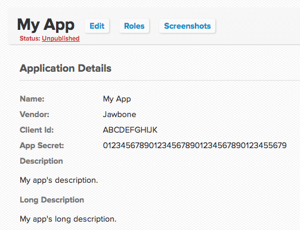
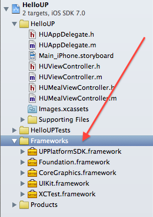
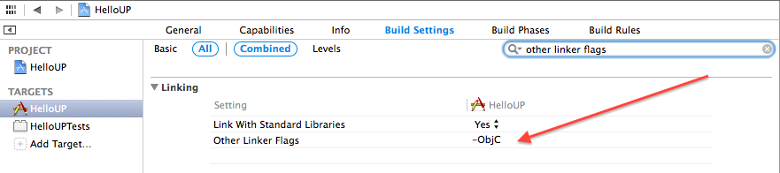
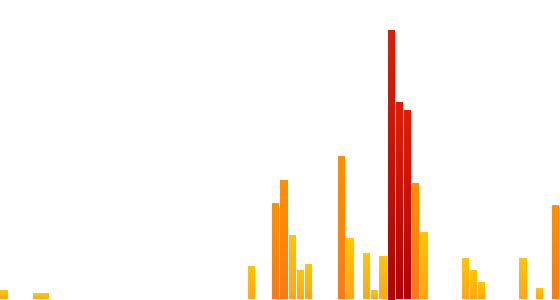
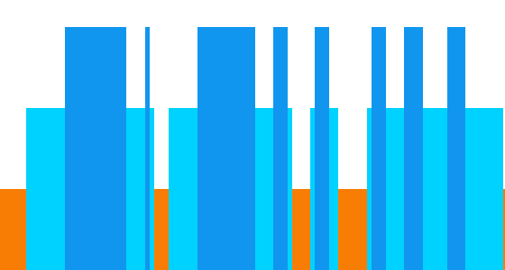

# UP Platform iOS SDK

## Overview

This SDK provides an Objective-C interface for integrating iOS apps with the [UP Platform](https://jawbone.com/up/developer). It handles authentication using OAuth 2.0 via a UIWebView and provides simple interfaces for making requests to the platform's REST endpoints.

## Requirements

The only requirements to start developing with the UP iOS SDK are OS X Mavericks, Xcode 5 and iOS 7. It is recommended that you upgrade to [OS X Mavericks](https://itunes.apple.com/us/app/os-x-mavericks/id675248567?mt=12#), [Xcode 5](http://itunes.apple.com/us/app/xcode/id497799835?ls=1&mt=12) and [iOS 7](https://developer.apple.com/ios7/) if you haven't done so already.

You will need to have access to an existing Jawbone UP user account in order to authenticate with the UP Platform. New accounts can be created by going to [jawbone.com/start/signup](http://jawbone.com/start/signup).

## Table of Contents

- [Getting Started](#getting-started)
  - [Obtain Your OAuth Credentials](#obtain-your-oauth-credentials)
  - [Download the Jawbone UP iOS SDK](#download-the-jawbone-up-ios-sdk)
  - [Run the Sample App](#run-the-sample-app)
  - [Add the SDK to Your Project](#add-the-sdk-to-your-project)
- [Documentation](#documentation)
  - [Authentication](#authentication)
  - [User](#user-information)
  - [Workouts](#workouts)
  - [Sleep](#sleeps)
  - [Meals](#meals)
  - [Moods](#moods)
  - [Cardiac](#cardiac)
  - [Body](#body)
  - [Generic](#generic)
  - [Custom Requests](#custom-requests)
- [Unit Tests](#unit-tests)
- [Additional Resources](#additional-resources)
- [Terms of Service](#terms-of-service)
- [API Status](#api-status)
- [Support](#support)
- [Credits](#credits)
- [License](#license)

## Getting Started

#### Obtain Your OAuth Credentials

Sign into the [Jawbone UP Developer Portal](http://developers.jawbone.com) using your Jawbone UP account. If you do not have an account you can create one by going to [jawbone.com/start/signup](https://jawbone.com/start/signup).

Register your organization by pressing "Manage Account".

Follow the instructions to create a new app and get your OAuth **Client ID** and **App Secret** keys that you will use to authenticate with the UP Platform.

Specify your custom redirect URI in the "OAuth Redirect URI" field or use the default value `up-platform://redirect`.  



#### Download the Jawbone UP iOS SDK.

You can download the latest iOS SDK release via the link below or clone it directly from this GitHub repository.

**Option 1:** Download UP iOS SDK v1.0.0 (November 2013)  
https://github.com/Jawbone/UPPlatformSDK/releases/tag/v0.1-alpha

**Option 2:** Clone this repository from GitHub  
`git clone git@github.com:Jawbone/UPPlatformSDK.git`

#### Run the Sample App

The Jawbone UP iOS SDK comes with a sample iOS app that you can use to authenticate with the UP Platform and start interacting with a Jawbone UP account.

You can find and open the PlatformTest project in `UPPlatformSDK/HelloUP/HelloUP.xcodeproj`.

#### Add the SDK to Your Project

* Drag `UPPlatformSDK.framework` into Frameworks group inside your Xcode project or workspace.



* Under Build Settings, add `-ObjC` to Other Linker Flags.



That's it!  
Now just add `#import <UPPlatformSDK/UPPlatformSDK.h>` wherever you want to use the SDK in your project.

# Documentation

## Authentication

Authentication is handled using the shared `UPPlatform` object. To start a new session, use the `startSessionWithClientID:clientSecret:authScope:completion:` method.  

*NOTE: If you specified a custom redirect URI for your app in the [Jawbone UP Developer Portal](http://developers.jawbone.com) you can specify it using the `startSessionWithClientID:clientSecret:authScope:redirectURI:completion:` method instead.*  


``` objective-c
[[UPPlatform sharedPlatform] startSessionWithClientID:@"MY_CLIENT_ID"
                                         clientSecret:@"MY_CLIENT_SECRET"
                                            authScope:(UPPlatformAuthScopeExtendedRead | UPPlatformAuthScopeMoveRead)
                                           completion:^(UPSession *session, NSError *error) {
                                               if (session != nil) {
                                                   // Your code to start making API requests goes here.
                                               }
}];
```
    
*NOTE: Possible UPPlatformAuthScope values can be found in `UPPlatform.h`.*

Once a valid session has been established, there are a few ways to create API requests. You can use either the provided objects that encapsulate most of the available endpoints, or you can create custom requests. The API Objects are the simplest way to create requests to the REST platform. They take creating the network requests and parsing the resulting JSON into `NSObject`s.

To validate that an existing session is still valid, call `validateSessionWithCompletion:`. If the `session` object passed to the completion block is not `nil`, the session is valid and API requests can be made.

## User Information

*NOTE: All units (weight, distance) are in metric.*

### Get detailed information about the user.

``` objective-c
[UPUserAPI getCurrentUserWithCompletion:^(UPUser *user, UPURLResponse *response, NSError *error) {
	// Your code to process returned UPUser object.
}];

```

### Get list of friends (identifiers)

``` objective-c
[UPUserAPI getFriendsWithCompletion:^(NSArray *friends, UPURLResponse *response, NSError *error) {
	// Your code here to process an array of UPUser objects.
}];
```

### Get the user's trends

``` objective-c
[UPUserAPI getTrendsWithEndDate:nil
                      rangeType:UPUserTrendsRangeTypeDays 
                  rangeDuration:10U
                     bucketSize:UPUserTrendsBucketSizeDays 
                     completion:^(NSArray *trends, UPURLResponse *response, NSError *error) {
	// Your code here to process an array of UPTrend objects.
}];
```

## Moves

### Get the user's move list (paginated by date or by a timestamp).

``` objective-c
[UPMoveAPI getMovesWithLimit:10U completion:^(NSArray *moves, UPURLResponse *response, NSError *error) {
	// Your code here to process an array of UPMove objects.
}];
```

### Get the user's move graph.


You can request a visualization of the user's moves data as a 560x300 PNG image with a transparent background.
``` objective-c
[UPMoveAPI getMoveGraphImage:move completion:^(UIImage *image) {
	// Your code here to process the graph image.
}];
```

## Workouts

### Get the user's workout list (paginated by date or by a timestamp).

``` objective-c
[UPWorkoutAPI getWorkoutsWithLimit:10U completion:^(NSArray *workouts, UPURLResponse *response, NSError *error) {
	// Your code here to process an array of UPWorkout objects.
}];
```

### Create a new workout.

We can start by creating a new workout event.

``` objective-c
UPWorkout *workout = [UPWorkout workoutWithType:UPWorkoutTypeBike
                                      startTime:startTime
                                        endTime:endTime
                                      intensity:UPWorkoutIntensityEasy
                                 caloriesBurned:@300];
                                 
workout.distance = @7;
workout.imageURL = @"YOUR_IMAGE_URL.png";
```

We can then post this workout event to the user's feed.

``` objective-c
[UPWorkoutAPI postWorkout:workout completion:^(UPWorkout *workout, UPURLResponse *response, NSError *error) {
	// Your completion code here.
}];
```

### Get the user's workout graph.


You can request a visualization of the user's workout data as a 560x300 PNG image with a transparent background.

``` objective-c
[UPWorkoutAPI getWorkoutGraphImage:workout completion:^(UIImage *image) {
	// Your code here to use the graph image.
}];
```

## Sleeps

### Get the user's recent sleep events.

``` objective-c
[UPSleepAPI getSleepsWithLimit:10U completion:^(NSArray *sleeps, UPURLResponse *response, NSError *error) {
	// Your code here to process an array of UISleep objects.
}];
```

### Get the user's sleep graph.


You can request a visualization of the user's sleep data as a 560x300 PNG image with a transparent background.
``` objective-c
[UPSleepAPI getSleepGraphImage:sleep completion:^(UIImage *image) {
	// Your code here to handle the graph image.
}];
```

## Meals

### Get the user's recent meal events.

``` objective-c
[UPMealAPI getMealsWithLimit:5U completion:^(NSArray *meals, UPURLResponse *response, NSError *error) {
	// Your code here to process the meals array.
}];
```

### Create a new meal

Meal events should be created with one or more meal items. To create a new meal event, we start by specifying nutritional information for a single meal item.

``` objective-c
UPMealNutritionInfo *info = [[UPMealNutritionInfo alloc] init];

info.calories = @130;
info.sugar = @30;
info.carbohydrates = @10;
info.calcium = @80;
```

Afterwards, we create a new meal item and set its nutritional information.
	
``` objective-c
UPMealItem *item = [UPMealItem mealItemWithName:@"Granola Bar" 
                                    description:@"A fancy granola bar."
                                         amount:@1 
                               measurementUnits:@"bar"
                                    servingType:UPMealItemServingTypePlate 
                                       foodType:UPMealItemFoodTypeBrand 
                                 nutritionInfo:info];
```

Then, we create a new meal event that will hold the meal item we had just created.

``` objective-c
UPMeal *meal = [UPMeal mealWithTitle:@"Delicious Granola Bar"
                                note:@"It was tasty" 
                               items:@[item]];
                               
meal.photoURL = @"YOUR_PHOTO_URL.png";
```

Finally, let's post a new event on the user's feed with our new meal!

``` objective-c	
[UPMealAPI postMeal:meal completion:^(UPMeal *meal, UPURLResponse *response, NSError *error) {
	// Your code here to process the meal object.
}];
```

### Get the information about a specific meal.

``` objective-c
[UPMealAPI getMealDetails:meal completion:^(UPMeal *meal, UPURLResponse *response, NSError *error) {
	// Your code here to process the meal object.
}];
```

## Moods

### Get the user's mood.

``` objective-c
[UPMoodAPI getCurrentMoodWithCompletion:^(UPMood *mood, UPURLResponse *response, NSError *error) {
	[self showResults:mood];
}];
```

### Record the user's mood.

To set the user's mood we first need to create a new UPMood object.

``` objective-c
UPMood *newMood = [UPMood moodWithType:UPMoodTypePumpedUp title:@"I'm pumped!"];
```

Then, we can post the new UPMood object to the user's feed.

``` objective-c
[UPMoodAPI postMood:newMood completion:^(UPMood *mood, UPURLResponse *response, NSError *error) {
	// Your code goes here.
}];
```

### Get the user's current mood.

``` objective-c
[UPMoodAPI getCurrentMoodWithCompletion:^(UPMood *mood, UPURLResponse *response, NSError *error) {
        // Your code goes here.
}];
```

### Delete a mood event.

``` objective-c
[UPMoodAPI deleteMood:mood completion:^(id result, UPURLResponse *response, NSError *error) {
	// Your code goes here.
}];


```
## Cardiac

To create a new cardiac event we first need to create a new UPCardiacEvent object.

``` objective-c
UPCardiacEvent *cardiacEvent = [UPCardiacEvent eventWithTitle:@"Run"
                                                    heartRate:@120
                                             systolicPressure:@120
                                            diastolicPressure:@80
                                                         note:@"Good weather."
                                                        image:nil];
```

Then, we can post the new UPCardiacEvent object to the user's feed.

``` objective-c
[UPCardiacEventAPI postCardiacEvent:cardiacEvent
                         completion:^(UPCardiacEvent *event, UPURLResponse *response, NSError *error) {
                                     
                         }];
```

### Request recent cardiac events.

``` objective-c
[UPCardiacEventAPI getCardiacEventsWithCompletion:^(NSArray *results, UPURLResponse *response, NSError *error) {
        // Your code goes here.
}];
```


### Delete a cardiac event.

``` objective-c
[UPCardiacEventAPI deleteCardiacEvent:event
                           completion:^(id result, UPURLResponse *response, NSError *error) {
                           	// Your code goes here.
                           }};
```

## Body

To create a new body event we first need to create a new UPBodyEvent object.

``` objective-c
UPBodyEvent *bodyEvent = [UPBodyEvent eventWithTitle:@"Morning start."
                                              weight:@70
                                             bodyFat:@0.14f
                                            leanMass:@29.5f
                                                 bmi:@18.5f
                                                note:@"Good progress."
                                               image:nil];
```

Then, we can post the new UPBodyEvent object to the user's feed.

``` objective-c
[UPBodyEventAPI postBodyEvent:bodyEvent
                   completion:^(UPBodyEvent *event, UPURLResponse *response, NSError *error) {
                   // Your code goes here.
}];
```

### Request recent body events.

``` objective-c
[UPBodyEventAPI getBodyEventsWithCompletion:^(NSArray *results, UPURLResponse *response, NSError *error) 
      // Your code goes here.
}];
```


### Delete a body event.

``` objective-c
[UPBodyEventAPI deleteBodyEvent:bodyEvent
                     completion:^(id result, UPURLResponse *response, NSError *error) {
                             // Your code goes here.
                     }];
```

## Generic

To create a new generic event we first need to create a new UPGenericEvent object.

``` objective-c
UPGenericEvent *genericEvent = [UPGenericEvent eventWithTitle:@"Good deed."
                                                         verb:@"Done well."
                                                   attributes:@{}
                                                         note:@"Indeed."
                                                        image:nil];
```

Then, we can post the new UPGenericEvent object to the user's feed.

``` objective-c
[UPGenericEventAPI postGenericEvent:genericEvent
                             completion:^(UPGenericEvent *event, UPURLResponse *response, NSError *error) {
                                   // Your code goes here.
}];
```

### Request recent generic events.

``` objective-c
[UPGenericEventAPI getGenericEventsWithCompletion:^(NSArray *results, UPURLResponse *response, NSError *error) {
     // Your code goes here.
}];
```

### Delete a generic event.

``` objective-c
[UPGenericEventAPI deleteGenericEvent:genericEvent
                           completion:^(id result, UPURLResponse *response, NSError *error) {
                               // Your code goes here.
                           }];
```

## Custom Requests

Custom API Requests can also be made using the `UPURLRequest` object, which is what the API Objects also use. This allows you to make a request to any endpoint, giving any parameters, and receiving a resulting JSON object. Here are a few examples:

### Get the current user's information.

``` objective-c
UPURLRequest *request = [UPURLRequest getRequestWithEndpoint:@"nudge/api/users/@me"
                                                      params:nil];

[[UPPlatform sharedPlatform] sendRequest:request
                              completion:^(UPURLRequest *request, UPURLResponse *response, NSError *error) {
    // The resulting response.data is an NSDictionary with the JSON results.
}];
```
    
### Post a new mood to UP.

``` objective-c
NSDictionary *params = @{
                         @"title": @"I feel great!",
                         @"sub_type": @1,
                         @"tz": [NSTimeZone localTimeZone].name
                         };

UPURLRequest *request = [UPURLRequest postRequestWithEndpoint:@"nudge/api/users/@me/mood"
                                                       params:params];

[[UPPlatform sharedPlatform] sendRequest:request
                              completion:^(UPURLRequest *request, UPURLResponse *response, NSError *error) {
    // The resulting response.data is an NSDictionary describing the created mood.
}];
```

# Unit Tests

The SDK ships with a suite of XCTest unit tests that cover the API functionality. You can run the tests by opening the UP iOSK SDK project in Xcode 5 and pressing <kbd>&#x2318;</kbd> + <kbd>Shift</kbd> + <kbd>U</kbd>.

# Additional Resources

You can find additional Jawbone UP Platform documentation at <https://jawbone.com/up/developer>.

# Terms of Service

Key principles governing the use of the UP API:

* The data belongs to the user. We are stewards of the data and have an obligation to protect it and use it responsibly.
* Data can only be collected with explicit user permission. Only collect what you need and only use it as you say you will.
* User must have a mechanism to disable access and to request that any collected data be deleted.
* Use of the UP API is governed by the [UP API Terms Of Service](https://jawbone.com/up/developer/terms). 

By using the API, you agree to the TOS, available for your review.

# API Status

Please visit UP Platform's [status page](http://status.jawbone.com/) to see the platform status updated in real-time.

# Support

Follow us on Twitter [@JawboneDev](https://twitter.com/jawbonedev) to get the latest news and updates regarding the API.

Contact the developer support team by sending an email to apisupport@jawbone.com.

# Credits

### Development

**Andy Roth**  
Senior Software Engineer  
Jawbone

# License

Usage is provided under the Apache License (v2.0). See LICENSE for full details.
